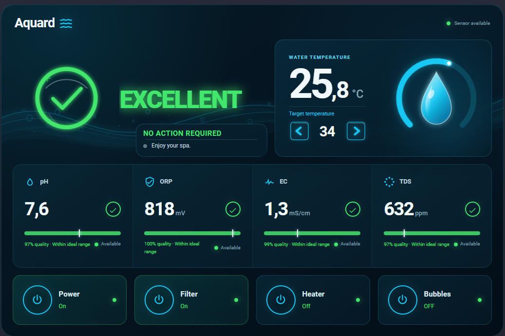

# Aquard



[](https://my.home-assistant.io/redirect/hacs_repository/?owner=Esirius81&repository=aquard&category=plugin)

Aquard is a modern Home Assistant card for monitoring water quality.

It brings multiple water measurements together in one easy-to-understand dashboard, so you can quickly see the condition of your water instead of interpreting several individual sensor values.

The project is currently focused on **spa monitoring**, but is designed around a **profile-driven architecture** so it can later support pools, aquariums, ponds and other water systems.

> **Current status:** Active development

---

## Why Aquard

Aquard is designed to answer one simple question:

> **Is my water ready?**

Rather than only displaying raw sensor values, Aquard evaluates the available measurements and presents a clear overall status.

## Why I Built Aquard

I originally built Aquard because I wanted better insight into my own Lay-Z-Spa. Looking at separate sensor values wasn't enough; I wanted one clear dashboard that showed whether my water was in good condition.

Aquard achieved exactly that goal for me. I'm sharing it because I hope other Home Assistant users can benefit from it as well.

## Features

### 🌊 Water Quality

- Intelligent Water Quality evaluation
- Combined Water Quality Score
- Profile-driven evaluation engine
- Individual measurement scoring
- Intelligent maintenance recommendations
- Four-level status system
  - Excellent
  - Monitor
  - Action Needed
  - Alert

---

### 🌡 Temperature

- Current water temperature
- Target temperature
- Premium SVG temperature gauge
- Climate integration

---

### 📊 Water Measurements

Currently supported:

- pH
- ORP
- EC
- TDS

Each measurement includes:

- Current value
- Individual quality evaluation
- Ideal range indicator
- Dynamic range visualization

---

### ⚙ Device Controls

Optional controls:

- Power
- Filter
- Heater
- Bubbles

Control changes are shown immediately and remain stable while Home Assistant confirms them. If confirmation does not arrive within nine seconds, Aquard quietly returns to the latest reported entity state and remains ready to retry.

Aquard automatically detects the supported entity type where possible.

---

### 🎨 Premium Interface

- Modern dark UI
- SVG graphics
- Premium temperature gauge
- Intelligent Water Status hero
- Responsive layout
- Theme-friendly styling

---

## Installation

### Manual Installation

Copy:

```text
dist/aquard-card.js
```

to:

```text
/config/www/
```

Then add the resource inside Home Assistant:

**Settings → Dashboards → Resources**

or:

```yaml
url: /local/aquard-card.js
type: module
```

Refresh the browser (`Ctrl+F5`) after installation.

---

## Configuration

### Adding Aquard through the UI

1. Edit your Home Assistant dashboard and choose **Add card**.
2. Search for and select **Aquard**.
3. Keep the currently supported **Spa** profile selected.
4. Select whichever Spa entities your installation provides.
5. Save the card. Aquard automatically composes the layout around the selected entities.

New cards deliberately start without invented entity IDs. Until at least one entity is selected, the preview shows a modest **Aquard setup** message instead of fabricated readings or a configuration error. Every entity is optional: unconfigured sensors and equipment are hidden automatically, while configured but unavailable entities remain visible with an unavailable state. A card can contain only monitoring, only temperature, only controls, or the complete Spa dashboard. YAML configuration remains fully supported.

When both a separate water-temperature sensor and a climate entity are configured, the separate sensor supplies the current reading and the climate entity supplies target-temperature controls. With only a climate entity, Aquard uses its `current_temperature` attribute.

### Visual Configuration Editor

Aquard can be configured directly in Home Assistant's visual card editor. The editor includes the profile, all supported device entities, and the card name, so YAML is not required.

YAML configuration remains fully supported and existing configurations continue to work unchanged. The currently supported profile is **Spa**. Additional profiles, including Pool, Aquarium, and Pond, will be added in future releases.

### YAML Configuration

Basic example:

```yaml
type: custom:aquard-card
name: Aquard
profile: spa
show_sensor_information: true

grid_options:
  columns: full
  rows: auto

entities:
  water_temperature: sensor.spa_temperature

  ph: sensor.spa_ph
  orp: sensor.spa_orp
  ec: sensor.spa_ec
  tds: sensor.spa_tds

  climate: climate.easy_spa_thermostat

  power: switch.easy_spa_power
  filter: switch.easy_spa_filter
  heater: climate.easy_spa_thermostat
  bubbles: select.easy_spa_bubbles
components:
  water_status: full
  temperature: full
  actions: full
  measurements: full
  controls: full
  details: full
```

`show_sensor_information` defaults to `true`. Set it to `false` to hide the detailed pH, ORP, EC, and TDS sensor information cards while keeping all water-quality calculations and action recommendations active.

---

## Advanced YAML configuration: component display modes

Aquard remains one reusable Home Assistant card. Advanced YAML users can set its six internal components to `full`, `compact`, or `hidden`. These modes are intentionally not exposed in the standard visual editor:

- `water_status` — overall water state and score
- `temperature` — current and target temperature controls
- `actions` — warnings and recommended guidance
- `measurements` — pH, ORP, EC, and TDS readings
- `controls` — power, filter, heater, and bubbles
- `details` — the card header and secondary availability metadata

The `components` mapping is optional. When it is absent, or when an individual component key is omitted, that component defaults to `full`. Existing YAML therefore keeps the complete premium card. Unknown configuration and component keys are preserved and safely ignored at runtime.

### Full default card

```yaml
type: custom:aquard-card
profile: spa
```

### Status-only card

```yaml
type: custom:aquard-card
profile: spa
components:
  water_status: full
  temperature: hidden
  actions: hidden
  measurements: hidden
  controls: hidden
  details: hidden
```

### Compact monitoring card

```yaml
type: custom:aquard-card
profile: spa
components:
  water_status: compact
  temperature: compact
  actions: hidden
  measurements: compact
  controls: hidden
  details: hidden
```

### Control card

```yaml
type: custom:aquard-card
profile: spa
components:
  water_status: hidden
  temperature: compact
  actions: hidden
  measurements: hidden
  controls: full
  details: hidden
```

Compact mode intentionally reduces information density while retaining essential values and touch-friendly controls. Hidden components render no wrapper or spacing. Component modes never override entity capability checks; for example, target controls still require a compatible climate entity.

## Supported Entities

| Entity | Required | Description |
|---|---|---|
| `water_temperature` | ✔ | Current water temperature |
| `ph` | ✔ | pH measurement |
| `orp` | ✔ | ORP measurement |
| `ec` | Optional | Electrical conductivity |
| `tds` | Optional | Total dissolved solids |
| `climate` | Optional | Used for target temperature |
| `power` | Optional | Power control |
| `filter` | Optional | Filter control |
| `heater` | Optional | Heater control using a climate entity or switch |
| `bubbles` | Optional | Bubble control |

The same climate entity may be configured for both `climate` and `heater`. The `climate` mapping provides target-temperature adjustment, while `heater` provides the on/off tile through supported HVAC modes.

---

## Bubble Control

Aquard automatically supports two Home Assistant entity types.

### Switch

```yaml
bubbles: switch.easy_spa_bubbles
```

Uses:

```text
switch.toggle
```

### Select

```yaml
bubbles: select.easy_spa_bubbles
```

Uses:

```text
select.select_next
```

No additional configuration is required.

---

## Water Quality Status

Aquard evaluates the available measurements and presents a single overall status.

| Status | Meaning |
|---|---|
| 🟢 Excellent | Everything is within the preferred operating range. |
| 🟡 Monitor | Water is still usable, but should be monitored. |
| 🟠 Action Needed | Maintenance is recommended. |
| 🔴 Alert | Water should be corrected or verified before use. |
| ⚪ Unknown | Required measurements are unavailable. |

The Water Quality Score is based on configurable profile thresholds.

EC is evaluated individually but is **not** included in the overall Water Quality calculation.

---

## Reference Setup

Aquard is currently developed and tested with:

- A Bestway Lay-Z-Spa
- An [AliExpress 7-in-1 WiFi Water Quality Sensor](https://nl.aliexpress.com/item/1005008896990245.html)

These are **not requirements**. Aquard only depends on Home Assistant entities and can work with many different hardware combinations.

I mounted my sensor inline using a custom 3D-printed adapter based on the [Lay-Z-Spa pump extrusion water sensor](https://makerworld.com/en/models/2889918-lay-z-spa-pump-extrusion-water-sensor). Full credit for the adapter design goes to its original designer.

This inline installation is entirely optional and is not required to use Aquard.

---

## Philosophy

Aquard is designed around one simple question.

> **Can I enjoy my water right now?**

Instead of only displaying raw sensor values, Aquard evaluates the available measurements and presents a clear overall status together with the most relevant recommendation.

Aquard is intended as a monitoring and guidance tool.

It does **not** replace proper water testing or manufacturer recommendations.

---

## Roadmap

Planned features include:

- Mobile / single-column layout
- Additional water profiles
- Historical graphs
- Maintenance reminders
- Localization
- Theme packs

---

## Development

Aquard is developed in my spare time and is currently under active development. The interface, evaluation engine and profile system are still evolving, so breaking changes may occur until the first stable release.

I use AI as a development assistant for architecture, documentation and implementation. This is also why the repository contains extensive documentation: it helps keep the project consistent and makes future development and contributions easier.

Contributions, ideas and feedback are welcome.

---

## License

AGPL-V3
